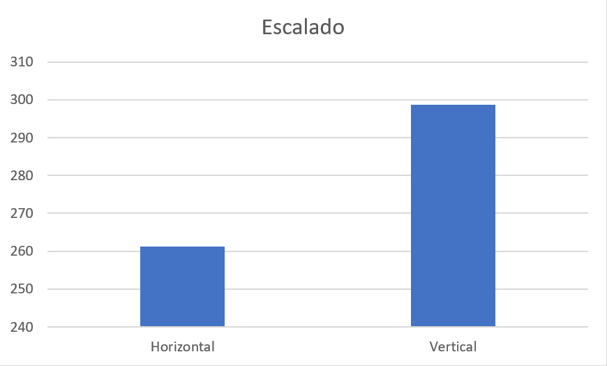
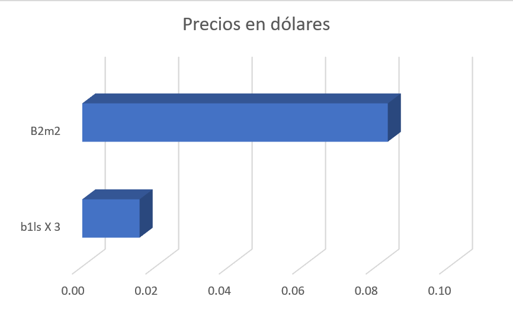
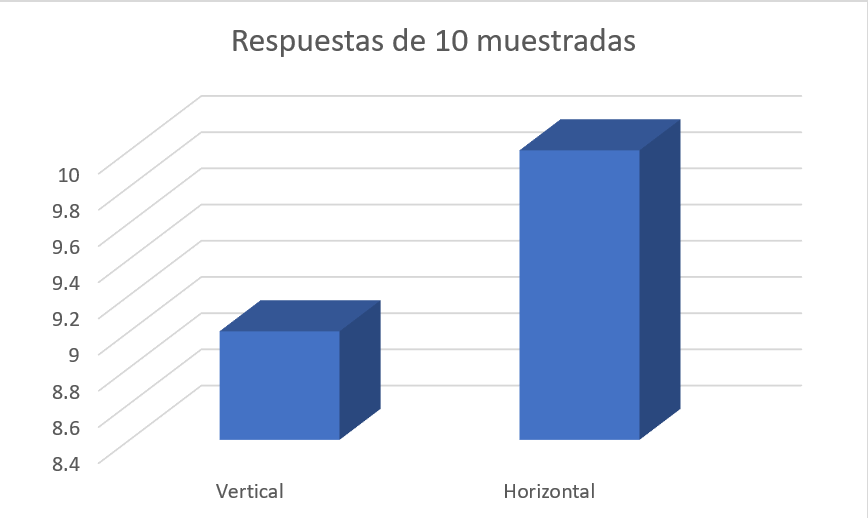
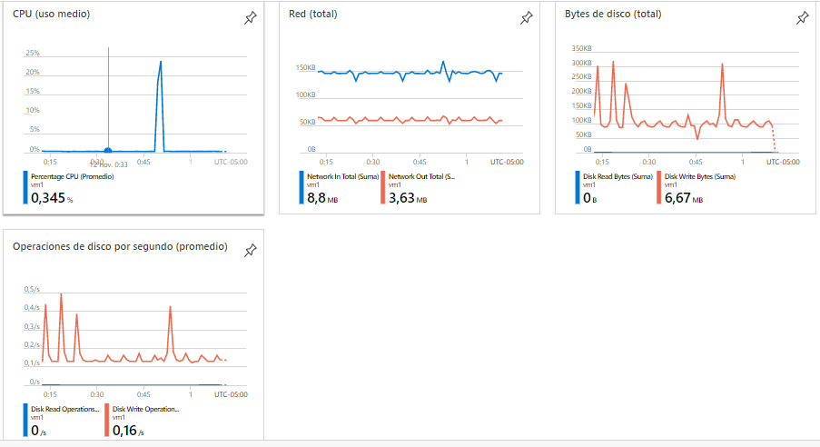
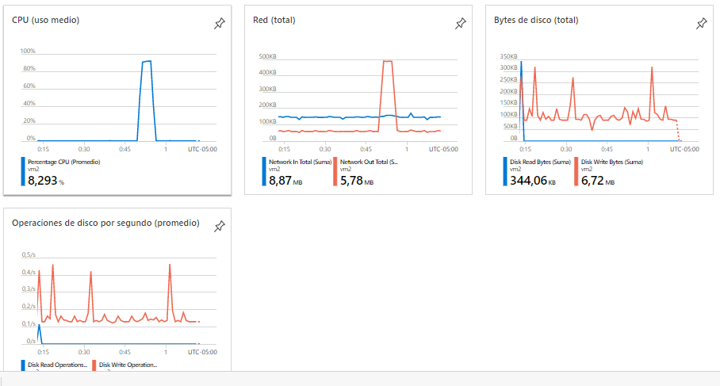
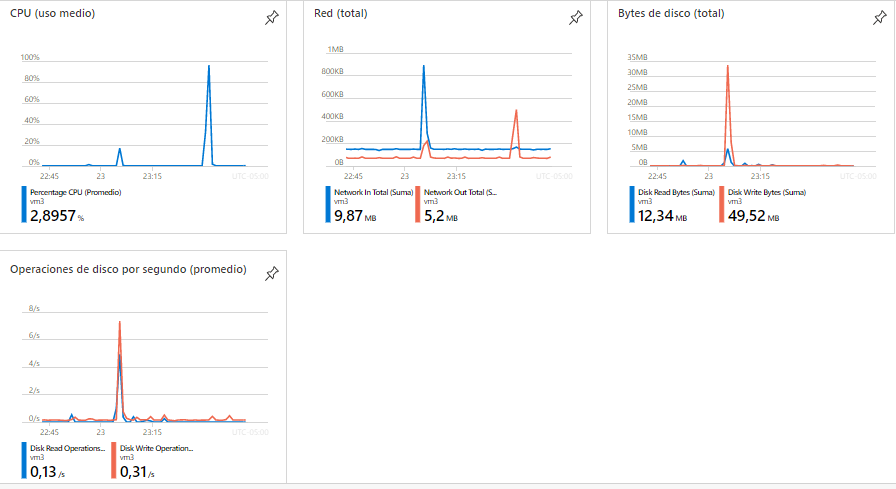
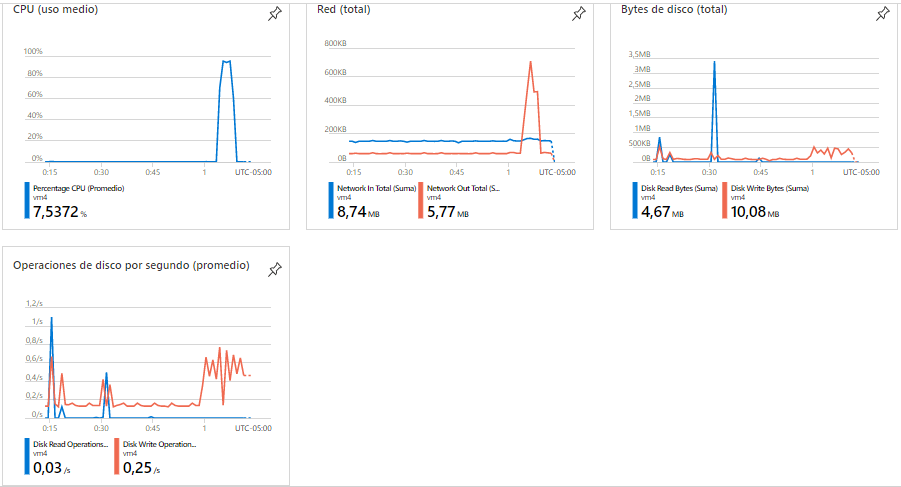

### Escuela Colombiana de Ingeniería
### Arquitecturas de Software - ARSW

#### Informe comparativo

Una vez hechas las pruebas, notamos una enorme diferencia en tiempo de respuesta total con respecto
a una iteración de newman.

 

Entre escalado horizontal y vertical vemos un incremento en tiempo de ***14.3%***.
Por el momento vemos que tener una máquina de mejor calidad vale más que tener 3 máquinas
iguales que se reparten la carga.

 

Este decremento en tiempo está dado con un incremento en costo del ***433%*** con 
respecto a la máquina sencilla de 1 core.

La cantidad de respuestas respondidas está dada por el siguiente gráfico. 

 

La máquina fuerte resultó ser menos confiable que las 3 máquinas al momento de recibir varias peticiones
de manera concurrente.

Como conclusión vemos que ambas aproximaciones tiene sus pros y contras, siendo la más
barata la instalación de 3 equipos, y también más confiable con respecto a la recepción de
solicitudes, pero es menos eficiente en términos de procesamiento, por lo que tener una máquina más fuerte es una opción,
pero costará 4.3 veces en este caso.

#### Informe comparativo de escalado horizontal

Una vez enviados 4 peticiones de manera paralela, se obtuvieron los siguientes resultados.

Una máquina muestra bajo uso de CPU y las otras no llegan del todo al 100% de uso de CPU,
por lo que hay espacio de mejora.
La tasa de éxito fue la misma, aún excelente. El éxito de estas peticiones es debido a la disponibilidad de 
equipos que aún tienen procesamiento disponible, por lo que el balanceador de carga podrá
repartir estas peticiones de manera inteligente, lo que no pasa con una sola máquina que
pone en cola múltiples peticiones mientras tiene uso alto de CPU y de memoria.
 